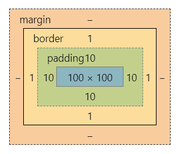

# 一 基础知识

CSS的初衷是提取出HTML中的表现性标记，使结构与表现分离。

**渐进增强 (progressive enhancement)：首先为最小公分母准备可用内容，再为支持新特性的浏览器添加更多交互优化。**对HTML而言，这意味着应使浏览器在遇到未知元素或属性时不会报错，也不会对页面产生影响；而对CSS而言，要在浏览器无法识别某些属性或值时提供合理的后备声明。

通过在标准名称前添加厂商指定的前缀字符串，可以特定某些浏览器识别对应的实验性特性。`-webkit-`前缀适用于如Safari、Chrome、Opera等基于WebKit的浏览器；`-moz-`前缀适用于基于Mozilla的浏览器如Firefox；`-ms-`适用于IE。最后应再加上一条不带前缀的声明给支持标准属性的浏览器。

若想==根据浏览器是否支持某个CSS特性来提供不同的样式==，使用**`@supports`**块，使用格式如：`@supports(display:grid) {}`。这个特殊的代码块称为条件规则，只有浏览器支持括号中的声明时，块中的规则才会被应用。但问题是其自身也不支持旧版本浏览器。

要在正确的地方使用正确的元素，使用**语义化标记**是优秀HTML的基础，结构良好的标记便于搜索引擎搜索，也便于增加CSS样式。编写CSS时，建议先给网站增添一组“基础”样式，再添加元素时，就不必再写样式。

==class的命名应表达组件类型==，而不应体现视觉样式。对于只能应用于一个元素的ID属性，应使其标识特定模块中的特定实例。实际开发中，用类来添加样式代码会更易于维护，==ID通常用于标识元素而不用于添加样式==。

HTML5结构化元素：section、header、footer、nav、article、aside、main。

~~扩展HTML语义：ARIA的role属性、微格式、微数据。~~<!--没太看懂，需要再次查阅相关资料理解。-->

[Can I use](https://www.caniuse.com/)网站可搜索属性查看支持浏览器百分比。使用Modernizr库可向前兼容老旧浏览器。

# 二 添加样式

## CSS选择符

- 类型选择符：`某元素`，选中某一类所有元素；
- 后代选择符：`父代 后代`，选中该父代的全部对应后代；
- ID选择符：`#ID名`，选中I拥有该ID属性元素；
- 类选择符：`.类名`，选中拥有该class属性元素；
- 子选择符：`父代>子代`，选中该父代的直系对应后代；
- 同辈选择符 (==同辈均拥有共同父元素==)：
  - 相邻同辈：`左元素+右元素`，选中某元素后面的相邻元素；
  - 一般同辈：`左元素~右元素`，选中某元素后所有元素；
- 通用选择符：`*`，匹配任何元素 (一般不建议用其来删除默认边距，最好还是明确指定元素来设定，或使用某些库)；
- 属性选择符：`元素[属性]`，可以根据是否存在某属性来选择，也可以根据特定属性值选择`元素[属性="值"]`，还可以应用匹配模式，如：
  - `a[href^="http:"]`：**`^`**匹配某些字符==开头==的属性值；
  - `img[src$=".jpg"]`：**`$`**匹配某些字符==结尾==的属性值；
  - `a[href*="/about/"]`：**`*`**匹配==包含==某些字符的属性值；
  - `a[rel~=next]`：**`~`**匹配以==空格分隔==的字符串中的属性值；
  - `a[lang|=en]`：**`|`**匹配开头为指定值或指定值后连接短线的情况；
- 伪元素：想选择的区域不是通过元素表示时可以通过伪元素来选择：
  - `::first-letter`：选择第一段文本的第一个字符；
  - `::first-line`：选择一段文本的第一个行；
- 伪类：想基于文档结构以外的情形来添加样式：
  - 超链接伪类
    - `:link`：未访问时；
    - `:visited`：访问过；
    - `:hover`：鼠标悬停时；
    - `:focus`：获得焦点时；
    - `:active`：活动状态时；
  - 目标与反选
    - `:target`：选择一个ID与当前URL片段匹配的元素；
    -  `:not()`：匹配不符合一组选择器的元素 ；
  - 结构化伪类
    - `:first-child`：选择第1个子元素；
    - `:last-child`：选择倒数第1个子元素；
    - `:nth-child(n)`：选择第n个子元素；
    - `:nth-last-child(n)`：选择倒数第n个子元素；
    - `:nth-of-type(n)`：选择第n个特定类型的子元素；
    - `:nth-last-of-type(n)`：选择倒数第n个特定类型的子元素；
    - `:only-child`：选择元素的唯一子元素；
    - `:only-of-type`：选择唯一特定类型的子元素；
  - 表单伪类
    - `:required`：选择拥有required属性的元素；
    - `:optional`：选择没有required属性的元素；
    - `:valid`：选择符合输入验证要求的元素；
    - `:invalid`：选择不符合输入验证要求的元素；
    - `:in-range`：选择值位于指定范围内的元素；
    - `:out-of-range`：选择值位于指定范围外的元素；
    - `:read-only`：选择不可被用户编辑的元素；
    - `:read-write`：选择可被用户编辑的元素；

## 层叠和特殊性

存在多个规则选择同一元素的情况时，CSS通过**层叠 (cascade)**机制来处理这种冲突。层叠机制的**重要性**级别如下：

- 标注`!important`的用户样式；
- 标注`!important`的作者样式；
- 作者样式；
- 用户样式；
- 浏览器 (或用户代码)的默认样式。

同级重要性则按选择符**特殊性**排序，如下：

- `!important`覆盖所有；
- 行内样式：1000；
- ID选择符：100；
- 类、属性选择符，伪类：10；
- 类型选择符，伪元素：1
- `*`：0；
- 继承的样式：小于0。

因样式表增大而被迫提高特殊性会使代码不必要地复杂化，最好==从一开始就简化选择符，降低特殊性==。

**继承**是指某些属性会直接应用到元素的后代。任何应用给元素的样式都会覆盖继承样式，因为继承样式没有任何特殊性。

**应用样式**

1. 直接使用`<style>`；
2. 使用`<link>`链接外部文件；
3. 使用`@important`加载外部文件。

样式声明的次序就是它们在HTML源码中声明的次序。

## 性能

1. 不要把CSS放在body里或放到页面底部；
2. 减少HTTP请求，线上网页最好把需要加载的CSS文件数量控制在2个以内，尽量不要使用`@important`；
3. 使用GZIP压缩线上资源，减少带宽占用，多数Web服务器都会在浏览器支持的情况下启用自动压缩线上资源；
4. 给`<script>`加上`async`或`defer`，不让浏览器渲染阻塞JS。

# 三 可见格式化模型

盒模型是CSS核心概念，所有元素都被看成一个矩形。padding用于分隔内容，使其不会散布到背景边界；margin在页面中控制元素间的距离。如下：

**`box-sizing`**属性可以改变计算盒子大小的方式，默认为content-box，意味着width和height的值仅为内容物content的大小。设置了`min/max-width`后，块级盒子能自动填充父元素宽度但不会收缩/扩大到限定宽度；设置高度则要慎重，最大高度应取决于包含的内容。

p、h1、article等块级元素以**块级盒子(block box)**形式显示；strong、span、time等行内元素则以**行内盒子(inline box)**的形式显示在行内。使用**`display`**可以改变生成的盒子类型，若设置为none那么浏览器不会为其生成盒子，即不显示其包含内容，不占用文档空间。

CSS有几种不同的定位模型：浮动、绝对定位、相对定位。默认所有盒子在常规文档流中生成，即**`position`**默认为static。块级盒子沿垂直方向堆叠，高度由margin决定；行内盒子沿文本流水平排列，高度不受任何设置影响。由一行文本形成的水平盒子叫**行盒子(line box)**，其高度由包含的行内盒子决定。若把display设置为**`inline-block`**，那么元素就会像行内盒子一样水平排列，内部仍像块级元素一样能够设置宽高和margin&padding。

块盒子内的夹缝内容也会生成块盒子，它无法被一般CSS选择符选中，称作**匿名块盒子(anonymous block box)**。类似的情况如某段落中包含三行文本，那么每一行都构成一个**匿名行盒子**。==屏幕上所显示的一切，均属于某个盒子。==

常规块盒子有一种叫**外边距折叠**的机制，无论什么情况，只要垂直方向上的两个margin相遇，都会以较大的那个为准折叠成一个。行内盒子、浮动盒子、绝对定位盒子的外边距不会折叠。

**包含块**是百分比值的计算依据，默认情况下，width/height/margin/padding的值为百分比时，就以该元素的父元素尺寸为计算依据，absolute元素的包含块是display属性为static以外值的祖先元素，若没有这样的元素那么相对于文档根元素(也叫起始包含块)html元素定位。

浮动元素会脱离文档流，若浮动元素后跟着常规元素，该元素盒子会当浮动元素不存在一样布局，元素内容却会避开浮动元素的空间，形成文本环绕效果。要阻止环绕，在对应行盒子上设置clear属性指明某侧不应紧贴浮动盒子。清除元素实际上是浏览器会在该元素上方添加足够大的外边距，将元素推到浮动元素下方，给“已清除”的元素添加外边距若未超过浏览器添加的值将没有效果。包裹浮动元素的元素无法生成高度，在其末尾添加一个空元素或使用`:after`伪类并为其指定clear可解决这个问题。

