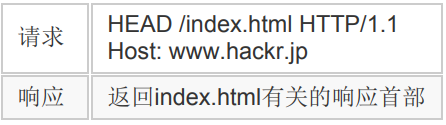

# 一 Web网络基础


## TCP/IP协议族

计算机和网络设备间若要通信，就必须基于相同的规则，这种规则就叫做协议(protocol)。协议包括各种内容，互联网相关协议总称为TCP/IP，通常使用的网络都是在TCP/IP协议族的基础上运作的。

TCP/IP协议族按层次分为：

- **应用层**：决定向用户提供应用服务时通信的活动。TCP/IP协议族内预存了各类通用的应用服务如FTP和DNS，HTTP也处于该层。
- **传输层**：向应用层提供处于网络连接中的两台计算机间的数据传输。有两个性质不同的协议——TCP和UDP。
- **网络层**：规定传输路线并传送数据包(网络传输最小单位)。
- **数据链路层**：网络连接的硬件部分，包括OS、设备驱动、NIC、光纤等。

如下图：客户端使用HTTP协议发出请求，为传输方便，TCP协议将接收到的HTTP请求报文分割并标记序号和端口号，然后IP协议为其增加作为通信目的的MAC地址后转发给链路层；服务器在链路层接收到数据后逐层向上传输并去掉对应的首部，当传输到应用层才算真正接收到这个请求。


### IP/TCP/DNS

**IP协议**负责传输数据包，几乎所有使用网络的系统都会用到。为保证确实的传送，需要IP地址和MAC地址。IP地址指明节点被分配到的地址，可变；MAC地址指网卡所属固定地址，基本不变。IP间通信依赖MAC地址，**ARP协议**可根据IP地址反查出MAC地址。双方通信通常要经过多台设备的中转，中转时，就是用下一站中转设备的MAC地址来搜索下一个中转目标。传输中的每个节点都无法获悉整个传输路线的全貌，这个机制称作**路由选择(routing)**。

位于传输层的**TCP协议**提供可靠的**字节流服务**。为方便传输，将大块数据分割为以报文段(segment)为单位的数据包进行管理；为准确无误将数据送至目标，TCP协议采用三次握手策略：发送端首先发送一个带SYN标志的数据包，接收端收到后，回传一个带有SYN/ACK标志的数据包以示传达确认信息，最后，发送端再回传一个带ACK标志的数据包，代表“握手”结束。这里的SYN (synchronize)和ACK (acknowledgement)都是TCP的标志，若某个阶段莫名中断则会再次以相同顺序发送相同数据包。

**DNS协议**位于应用层，提供从域名到IP地址，从IP地址反查域名的解析服务。


## URI和URL

 **URI(Uniform Resource Identifier)**是由某个协议方案表示资源定位标识符。规定统一格式便于处理不同类型的资源，不必根据环境来识别资源指定的访问方式，加入新增的协议方案也更容易；“资源”的定义是“可标识的任何东西”，也可以是多数内容的集合体。标准URI协议方案有30多种，由IANA管理颁布。

URI用字符串标识某一互联网资源，而**URL(Uniform Resource Locator)**表示资源在互联网所处的位置，即URL是URI的子集。

绝对URI格式如下：


- 协议名不区分大小写；
- 登录信息是从服务器端获取资源时必要的身份认证信息，可选；
- 服务器地址可以是域名，也可以是IPv4或IPv6地址名；
- 服务器端口号可选，省略则使用默认端口号；
- 文件路径用于在服务器种定位需要的资源；
- 针对文件路径内的资源，可以使用查询字符串可传入任意参数，可选；
- 片段标识符可标记出已获取资源中的子资源，可选；


# 二 HTTP协议

应用HTTP协议的双方通信时，发送请求的一方担任客户端，提供资源响应的一方作为服务端。HTTP协议规定由客户端发出请求报文并开始建立通信，服务端在没有接收到请求之前不会发送响应。为处理大量事务和确保协议可伸缩性，HTTP协议被涉及的十分简单，而被应用在各种场景中。


## HTTP报文

 用于 HTTP 协议交互的信息被称为HTTP报文，其本身是由多行(CR+LF作换行符)数据构成的字符串文本。

最初出现的空行将报文划分为报文首部和报文主体。请求报文首部第一行为**请求行**，包含请求的方法，URL和HTTP版本；响应报文首部第一为**状态行**，包含表明响应结果的状态码，原因短语和HTTP版本。首部字段表示请求和响应的各种条件和属性。

 **实体(entity)**作为请求或响应的有效载荷数据（补充项）被传输，其内容由实体首部和实体主体组成。 HTTP 报文的主体用于传输请求或响应的实体主体。  通常，报文主体等于实体主体。只有当传输中进行编码操作时，实体主 体的内容发生变化，才导致它和报文主体产生差异。 

```http
// 请求报文
GET /index.htm HTTP/1.1
Host: hackr.jp
Content-Type: application/x-www-form-urlencoded
Content-Length: 16
// 服务端的响应
HTTP/1.1 200 OK
Date: Tue, 10 Jul 2012 06:50:15 GMT
Content-Length: 362
Content-Type: text/html
<html>...
```

- 请求：“GET”表示请求类型，称作方法；“/index.htm”指明请求访问的资源对象，也叫请求URI(request-URI)；“HTTP/1.1”表示HTTP的版本。这之后的内容为首部字段，首部字段的“Host”可写明域名或IP地址。
- 响应：“HTTP/1.1”表示HTTP的版本；“200”是表示请求处理结果的状态码(status code)，“OK”是原因短语(reason-phrase)；下一行是响应创建的日期时间。之后的内容为首部字段。空一行后的内容为资源主体。

HTTP在传输时可通过**编码**提升传输速率，编码的操作由计算机完成，需要消耗一定CPU等资源。传输大容量数据时，可以把数据分割成多块传输，称作**分块传输编码(Chunked Transfer Coding)**。MIME扩展中有称作**Multipart**的方法来容纳多种不同类型的数据，HTTP也采用了Multipart，使用时要在首部字段加上`Content-type`，再使用`boundary`来划分Multipart指明的各类实体。通过`Range`可以指定资源的byte范围来分批请求资源。同一Web界面中可能存在多份内容相同但语言不同的界面，服务器端和客户端会就响应的资源内容进行交涉选取最合适的资源，这称作**内容协商(Content Negotiation)**。


## 请求方法

**GET：获取资源**

GET 方法用来请求访问已被 URI 识别的资源。指定资源经服务器端解析后返回响应内容。如果请求文本，则原样返回；如果是像 CGI(Common Gateway Interface，通用网关接口)那样的程序，则返回经过执行后的输出结果。


**POST：传输实体主体**

 虽然用 GET 方法也可以传输实体的主体，但一般用 POST 进行传输。


 **PUT：传输文件** 

 PUT 方法用来传输文件。就像 FTP 协议的文件上传。在请求报文的主体中包含文件内容，保存到请求 URI 指定的位置。 鉴于 HTTP/1.1 的 PUT 不带验证，存在安全问题，因此一般网站不使用该方法。若配合 Web 应用程序的验证机制，或架构设计采用 REST(REpresentational State Transfer，表征状态转移)标准的同类 Web 网站，就可能会开放使用 PUT 方法。


**HEAD：获得报文首部** 

 HEAD 方法和 GET 方法一样，只是不返回报文主体部分，用于确认 URI 的有效性及资源更新的日期时间等。 




**DELETE：删除文件**

 DELETE 方法按 请求 URI 删除指定的资源， 是与 PUT 相反的方法，同 PUT 一样要在特定条件下才会被开放使用。


**OPTIONS：询问支持的方法**

 OPTIONS 方法用来查询针对请求 URI 指定的资源支持的方法。 


**TRACE：追踪路径**

 TRACE 方法是让 Web 服务器端将之前的请求通信环回给客户端的方法。 发送请求时，在 Max-Forwards 首部字段中填入数值，每经过一个服务器端就将该数字减 1，当数值刚好减到 0 时，就停止继续传输，最后接收到请求的服务器端则返回状态码 200 OK 的响应。

 客户端通过 TRACE 可以查询发出去的请求是怎样被加工修改/ 篡改的。这是因为，请求想要连接到源目标服务器可能会通过代理中转，TRACE 方法就是用来确认连接过程中发生的一系列操作。 但TRACE不常用，而且容易引发引发 XST (Cross-Site Tracing，跨站追踪)攻击，通常就更不会用到了。 


**CONNECT：要求用隧道协议连接代理**

 CONNECT 方法要求在与代理服务器通信时建立隧道，实现用隧道协 议进行 TCP 通信。主要使用 SSL(Secure Sockets Layer，安全套接层)和 TLS (Transport Layer Security，传输层安全)协议把通信内容加密后经网络隧道传输。


## 状态码

状态码的描述了请求的处理结果，由3位数字和原因短语组成，数字第一位指示响应类别(共5种)，后两位无分类。经常使用的状态码大概只有14种。

- 1XX——Informational（信息性状态码）——接收的请求正在处理；
- 2XX——Success（成功状态码）——请求正常处理完毕；
- 3XX——Redirection（重定向状态码）——需要进行附加操作以完成请求 ；
- 4XX——Client Error（客户端错误状态码）——服务器无法处理请求；
- 5XX——Server Error（服务器错误 状态码）——服务器处理请求出错。


### 2XX 成功

 2XX 的响应结果表明请求被正常处理了。


**200 OK**

 表示从客户端发来的请求在服务器端被正常处理了。 响应报文内随状态码一起返回的信息因方法的不同而不同。 


**204 No Content**

 该状态码代表服务器接收的请求已成功处理，但在返回的响应报文中不含实体的主体部分，也不允许返回任何实体的主体。 一般在只需要从客户端往服务器发送信息，而对客户端不需要发送新信 息内容的情况下使用。 


**206 Partial Content**

 该状态码表示客户端进行了范围请求，而服务器成功执行了这部分的 GET 请求。响应报文中包含由 Content-Range 指定范围的实体内容。 


###  3XX 重定向

 3XX 响应结果表明浏览器需要执行某些特殊的处理以正确处理请求。 


 **301 Moved Permanently**

 永久性重定向。该状态码表示请求的资源已被分配了新的 URI，以后应使用资源现在所指的 URI。


**302 Found**

 临时性重定向。该状态码表示请求的资源已被分配了新的 URI，希望用户（本次）能使用新的 URI 访问。 和 301 Moved Permanently 状态码相似，但 302 状态码代表的资源不 是被永久移动，只是临时性质的。换句话说，已移动的资源对应的 URI 将来还有可能发生改变。 


**303 See Other**

 表示由于请求对应的资源存在着另一个 URI，应使用 GET 方法定向获取请求的资源。  303 状态码和 302 Found 状态码有着相同的功能，但 303 状态码明确表示客户端应当采用 GET 方法获取资源，这点与 302 状态码有区别。 

 当 301、302、303 响应状态码返回时，几乎所有的浏览器都会把 POST 改成 GET，并删除请求报文内的主体，之后请求会自动再次 发送。 301、302 标准是禁止将 POST 方法改变成 GET 方法的，但实际使 用时大家都会这么做。


**304 Not Modified**

 该状态码表示客户端发送附带条件的请求时，服务器端允许请求访问 资源，但未满足条件的情况。304 状态码返回时，不包含任何响应的主体部分。304 虽然被划分在 3XX 类别中，但是和重定向没有关系。 

*附带条件的请求指采用 GET 方法的请求报文中包含 If-Match，If-Modified-Since，If-NoneMatch，If-Range，If-Unmodified-Since 中任一首部。*


**307 Temporary Redirect**

 临时重定向。该状态码与 302 Found 有着相同的含义。尽管 302 标准禁止 POST 变换成 GET，但实际使用时大家并不遵守。 307 会遵照浏览器标准，不会从 POST 变成 GET。但是，对于处理响应时的行为，每种浏览器有可能出现不同的情况。


###  4XX 客户端错误

 4XX 的响应结果表明客户端是发生错误的原因所在。 


**400 Bad Request**

 该状态码表示请求报文中存在语法错误。当错误发生时，需修改请求的内容后再次发送请求。另外，浏览器会像 200 OK 一样对待该状态码。


**401 Unauthorized**

 该状态码表示发送的请求需要有通过 HTTP 认证（BASIC 认证、 DIGEST 认证）的认证信息。 返回含有 401 的响应必须包含一个适用于被请求资源的 WWWAuthenticate 首部用以质询（challenge）用户信息。当浏览器初次接收 到 401 响应，会弹出认证用的对话窗口。 


**403 Forbidden**

 该状态码表明对请求资源的访问被服务器拒绝了。服务器端没有必要给 出拒绝的详细理由，但如果想作说明的话，可以在实体的主体部分对原 因进行描述，这样就能让用户看到了。 未获得文件系统的访问授权，访问权限出现某些问题（从未授权的发送 源 IP 地址试图访问）等列举的情况都可能是发生 403 的原因。 


**404 Not Found**

 该状态码表明服务器上无法找到请求的资源。除此之外，也可以在服务器端拒绝请求且不想说明理由时使用。 


###  5XX 服务器错误 

 5XX 的响应结果表明服务器本身发生错误。 


**500 Internal Server Error**

 该状态码表明服务器端在执行请求时发生了错误。也有可能是 Web 应 用存在的 bug 或某些临时的故障。 


**503 Service Unavailable**

该状态码表明服务器暂时处于超负载或正在进行停机维护，现在无法处 理请求。如果事先得知解除以上状况需要的时间，最好写入 RetryAfter 首部字段再返回给客户端。


## 其他技术

### Cookie

 HTTP 是无状态协议，它不对之前发生过的请求和响应的状态进行管理。虽然减少了服务器CPU及内存资源的消耗，但这样就无法根据之前的状态进行新的请求处理。HTTP1.1引入 Cookie技术来实现保持状态的功能。

 Cookie 会根据从服务器端发送的响应报文内的一个叫做 Set-Cookie 的首部字段信息，通知客户端保存 Cookie。当下次客户端再往该服务器发送请求时，会自动在请求报文中加入Cookie 值。 服务器端Cookie 后检查究竟是从哪个客户端发来的请求，对比服务器上的记录，得到之前的状态信息。如下图：


### 持久连接

 HTTP 协议的初始版本中，每进行一次 HTTP 通信就要断开一次 TCP 连接。随着互联网的发展，文档中包含大量图片等情况增多，每次请求都会有无谓的TCP连接建立和断开，增加了通信量的开销。

为解决这个问题，HTTP/1.1 和部分 HTTP/1.0 想出了**持久连接** (HTTP Persistent Connections，也称为 HTTP keep-alive 或 HTTP connection reuse)的方法，只要任意一端没有明确提出断开连接，则保持 TCP 连接状态。HTTP/1.1 中所有的连接默认都是持久连接。

持久连接使得多数请求以**管线化(pipelining)**方式发送成为可能，不必等待前一次请求的响应即可直接发送下一个请求。


##  Web 服务器 


 ### 虚拟主机

HTTP/1.1 规范允许一台 HTTP 服务器搭建多个 Web 站点。提供 Web 托管服务(Web Hosting Service)的供应商，可用一台服务器服务多位客户，也可以每位客户持有的域名运行不同网 站。这是利用了**虚拟主机**(Virtual Host，又称虚拟服务器)的功能，物理层面只有一台服务器，但可假想具有多台服务器。 

访问目标网站时，DNS先将域名解析为IP地址，当两个域名被同一台服务器托管的话就无法分清了，因此再IP地址相同时必须在Host首部内完整指定主机名或域名的URI。


### 通信转发

HTTP 通信时，除客户端和服务器以外，还有一些用于通信数据转发的应用程序可以配合服务器工作，如代理、网关和隧道。


####  代理

 代理服务器的基本行为就是接收客户端发送的请求后转发给其他服务器。代理不改变请求 URI，直接发送给前方持有资源的目标服务器。 持有资源实体的服务器被称为源服务器。从源服务器返回的响应经过代理服务器后再传给客户端。转发时，需要附加 Via首部字段以标记出经过的主机信息。如下：


可以预先将资源副本(也叫**缓存**)保存在代理服务器上以避免对源服务器重复的访问，还可以在代理服务器上针对特定URL进行访问控制。代理有多种使用方法，按两种基准分：是否使用缓存，是否会修改报文。

 另外，即使存在缓存，也会因为客户端的要求、缓存的有效期等因素，向源服务器确认资源的有效性。若判断缓存失效，缓存服务器将会再次从源服务器上获取“新”资源。 缓存不仅可以存在于缓存服务器，还可以存在客户端浏览器中，称作临时网络文件(Temporary Internet File)。


#### 网关 

 网关和代理很相似， 而网关能使通信线路上的服务器提供非 HTTP 协议服务。   利用网关能提高通信的安全性，因为可以在客户端与网关之间的通信线 路上加密以确保连接的安全。比如，网关可以连接数据库，使用 SQL 语句查询数据。另外，在 Web 购物网站上进行信用卡结算时，网关可以和信用卡结算系统联动。 


#### 隧道 

 隧道可按要求建立起一条与其他服务器的通信线路，届时使用 SSL 等 加密手段进行通信。隧道的目的是确保客户端能与服务器进行安全的通信。隧道本身不会去解析 HTTP 请求，请求会保持原样中转给之后的服务器。隧道在通信双方断开连接时结束。 隧道本身是透明的，客户端不用在意隧道的存在。


